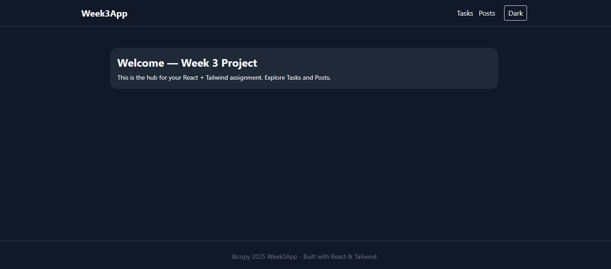
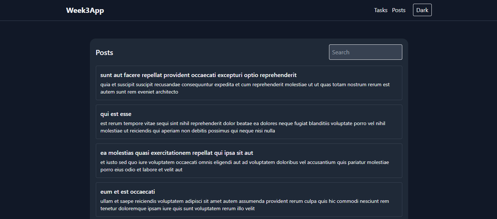

#  React + Tailwind CSS Project

##  Overview

This project is a modern **React.js** application built using **Vite** and styled with **Tailwind CSS**. It showcases clean component architecture, responsive design, and smooth user experience — all powered by lightweight and blazing-fast tools.

This app serves as a template or portfolio project for anyone diving into **modern front-end development** using **React** and **Tailwind**.

---

##  Features

- ** Fast Setup with Vite** – instant dev server, hot reload
- ** Tailwind CSS Styling** – utility-first, fully responsive design
- ** Reusable Components** – Navbar, Buttons, Cards, and Footer
- ** Dark/Light Mode Toggle** – seamless theme switching
- ** Local Storage Support** – keeps data saved even after refresh
- ** API Integration** – connects with external APIs
- ** Deployed on Netlify** – free hosting with auto builds

---

##  Folder Structure

```
project-root/
├── src/
│   ├── assets/         # images, icons, and logos
│   ├── components/     # reusable UI elements
│   ├── pages/          # app pages (Home, Tasks, Posts, etc.)
│   ├── context/        # Theme/State context
│   ├── App.jsx         # root component
│   ├── main.jsx        # entry file
│   └── index.css       # Tailwind CSS entry
├── public/
│   └── favicon.ico
├── tailwind.config.js
├── postcss.config.js
├── package.json
└── README.md
```

---

##  Installation & Setup

### 1️⃣ Clone this repository

```bash
git clone https://github.com/PLP-MERN-Stack-Development/react-js-jsx-and-css-mastering-front-end-development-DANKlEIN117.git
```

### 2️⃣ Navigate into the project

```bash
cd your-repo-name
```

### 3️⃣ Install dependencies

```bash
npm install
```

### 4️⃣ Run the development server

```bash
npm run dev
```

Your app will be live at: **[http://localhost:5173/](http://localhost:5173/)**

---

##  Build for Production

When ready to deploy:

```bash
npm run build
```

Your optimized files will be in the **`dist/`** folder.

---

##  Deployment on Netlify

### Option 1: Deploy via GitHub (Recommended)

1. Push your project to GitHub
2. Go to [Netlify](https://app.netlify.com/)
3. Click **"Add New Site" → "Import an existing project"**
4. Connect your GitHub account and select your repository
5. In **Build settings**, configure:
   - **Build command:** `npm run build`
   - **Publish directory:** `dist`
6. Click **Deploy site** 

Netlify will automatically build and host your app. You'll receive a live link like:


##  Tech Stack

| Technology            | Purpose                    |
| --------------------- | -------------------------- |
| **React.js (Vite)**   | Frontend Framework         |
| **Tailwind CSS**      | Utility-First Styling      |
| **JavaScript (ES6+)** | Application Logic          |
| **Netlify**           | Deployment & Hosting       |
| **Context API**       | Global State Management    |

---

## Screenshots


| Home Page                       | Dashboard                         | Dark Mode                           |
| ------------------------------- | --------------------------------- | ----------------------------------- |
|  |  |  |


## Author

**Dan Okoth (Boss)**
 Kenya

> "Write clean code. Debug like a hacker. Ship like a pro."

- **GitHub:** [@DANKlEIN117](https://github.com/DANKlEIN117)
- **Email:** [omondiokothdan@gmail.com](mailto:omondiokothdan@gmail.com)
- **Portfolio:** Coming soon...

---

## 🔗 Live Demo

👉 **[View on Netlify](https://sparkling-zuccutto-b09da5.netlify.app/)**

---

## 🧩 Commands Reference

| Command           | Description                       |
| ----------------- | --------------------------------- |
| `npm install`     | Install all dependencies          |
| `npm run dev`     | Run local development server      |
| `npm run build`   | Build for production              |
| `npm run preview` | Preview production build locally  |

---

## 🤝 Contributing

Contributions are welcome! Feel free to fork this repo and submit a pull request with your improvements.

---

## 📝 License

This project is open source and available under the MIT License.

---

> 🛠️ Built with passion and caffeine ☕ using React + Tailwind
>
> ⭐ Star this repo if you found it helpful!
